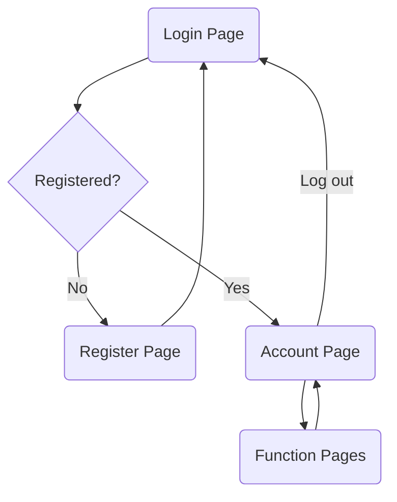
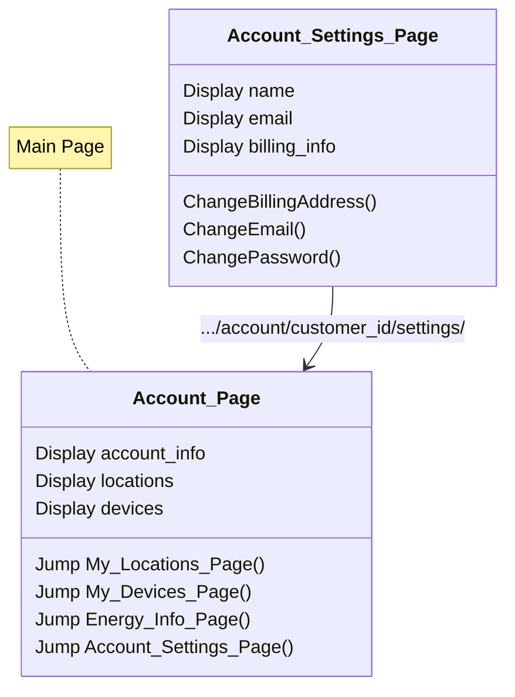
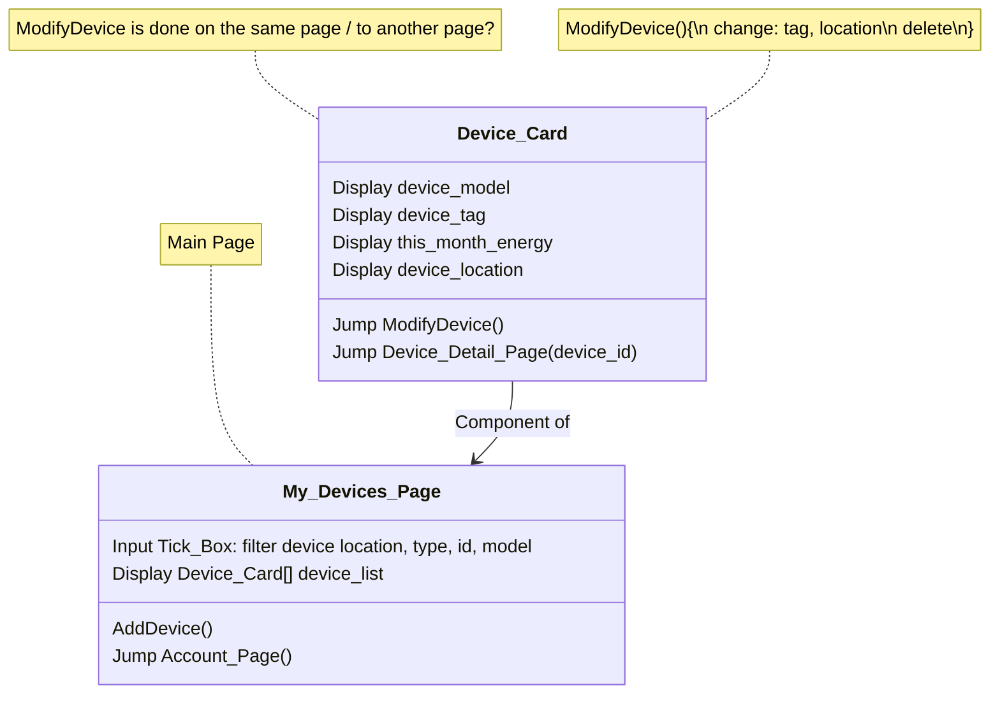
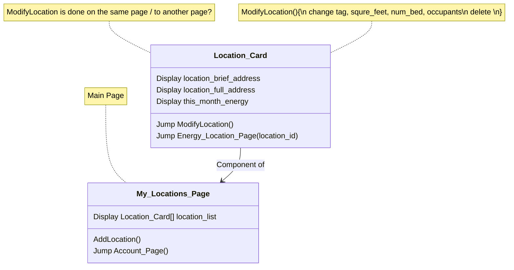
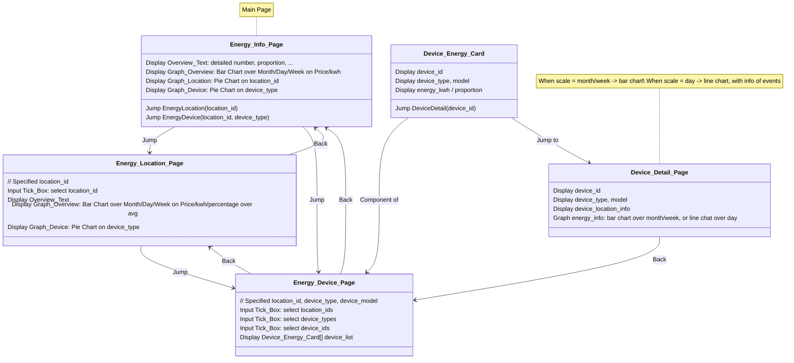

# Basic UX Logic

## Account

## Devices

## Locations

## EnergyInfo

### Conclusion On Graphs

1. Bar Chart
   1. Energy_Info_Page
      - X-Axis: Month, Week, Day | Y-Axis: kwh, price
   2. Energy_Location_Page
      - X-Axis: Month, Week, Day | Y-Axis: kwh, price, percentage vs. avg
   3. Device_Detail_Page
      - X-Axis: Month, Week, Day | Y-Axis: kwh, price
2. Pie Chart
   1. Energy_Info_Page
      - different location_ids
   2. Energy_Location_Page
      - different device_types
3. Line Chart
   1. Device_Detail_Page
      - X-Axis: Hour of day | Y-Axis: kwh, price
      - Event displayed on line
